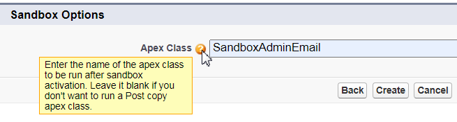

# Using SandboxAdminEmail

This is very simple code that removes the ".invalid" from Administrator email addresses when creating a new Sandbox. That way the admin that created the sandbox doesn't have to go in and enable it for all of the other admins. 

Admins will receive the "Sandbox: Finish changing your Salesforce account’s email address" email, letting them know they have access. 

Usage is simple, too. 
<ol>
<li>Add SandboxAdminEmail.cls and SandboxAdminEmail.cls-meta.xml (from /force-app/main/default/classes/) to your DX project</li>
<li>Use SFDX CLI to deploy it to your org with:</li>

``` 
sfdx force:source:deploy -p force-app/main/default/classes/SandboxAdminEmail.cls -u [USERNAME]
```
<li>The next time you create a sandbox, enter the class name (SandboxAdminEmail) at the prompt as shown below</li>


</ol>

You can also run the class with Execute Anonymous in the sandbox after it has been created if you forget to run it now. 

## TODO:
- Add sample syntax for creating and running with CLI. Meanwhile, the SFDC documentation can be found at https://developer.salesforce.com/docs/atlas.en-us.sfdx_dev.meta/sfdx_dev/sfdx_dev_create_clone_sandboxes.htm.
- Have two sets of instructions: one for developers and one for admins
