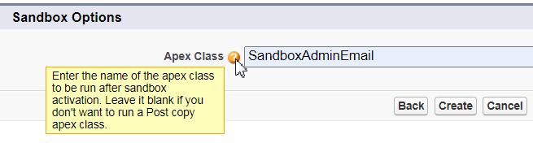

# Welcome to the Logic20/20 Public SFDC/X Repo
Our architects and developers seldom have time after a project completes to share tips, shortcuts, and pre-built components to the public before moving on to the next project. When they do, or take some personal time to contribute, the results will be published here.

The repository is layed out as an SFDX project. This format is for the convenience of testing before publishing. Our recommendation is to use the latest Salesforce SFDX project template for your own projects and only copy individual, useful artifcats from here as needed.

## In this repository...
- [Frequently used Salesforce CLI commands](/sfdx-cli-common-commands.md)

- 

## On the Logic20/20 site
<a href="https://www.logic2020.com/insight/tactical/low-code-no-code-considerations">5 points to consider about low-code/no-code (LCNC) solutions</a>

<a href="https://www.logic2020.com/insight/tactical/salesforce-webhook-listener">A quick and simple Salesforce webhook listener</a>

<a href="https://www.logic2020.com/insight/tactical/salesforce-unlocked-packages">A simple Salesforce Package cheat sheet</a>

<a href="https://www.logic2020.com/insight/tactical/how-tackle-sfdc-sap-integration-from-heck">How we tackled the SFDC-SAP "Integration from Heck</a>

<a href="https://www.logic2020.com/insight/tactical/how-to-set-up-self-registration-in-a-salesforce-community">How to set up self-registration in a Salesforce community</a>

<a href="https://www.logic2020.com/insight/tactical/sfdx-vscode-and-deploying-from-a-package">SFDX, VSCode, and deploying from a package</a>

<a href="https://www.logic2020.com/insight/tactical/how-to-install-custom-components-salesforce-trailhead-playground-orgs">How to install custom components in Salesforce Trailhead Playground Orgs</a>
